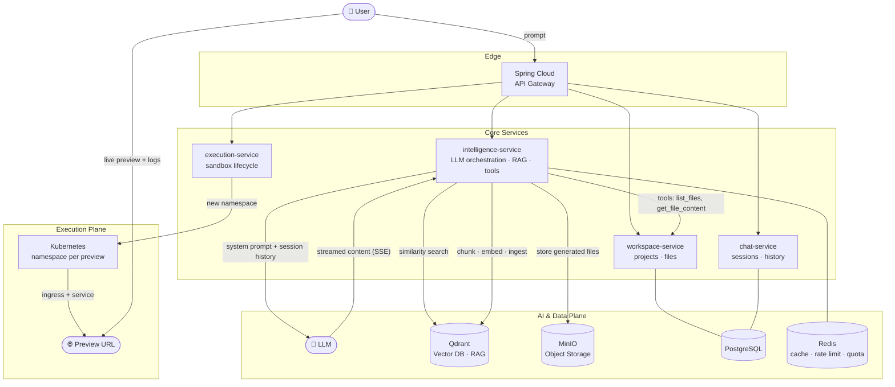
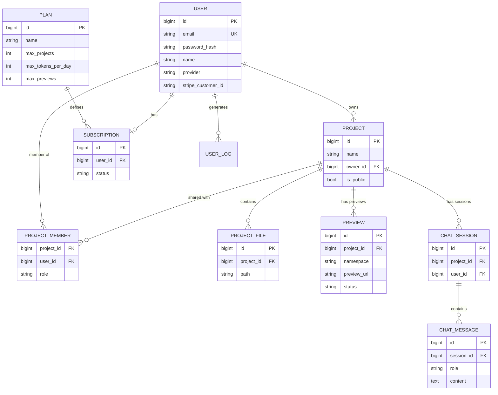

<div align="center">

# ⚡ compyl.ai

### Prompt-to-Production — an AI software engineer that turns natural language into live, deployable web apps.

*Describe what you want. compyl.ai writes the code, runs it in an isolated sandbox, and hands you a live preview URL — in seconds.*

<br/>


</div>

---

## 📖 Overview

**compyl.ai** is a distributed, AI-native application-building platform — a from-scratch reimagining of tools like Lovable, built to learn and demonstrate **production-grade backend engineering at scale**.

A user types a prompt (*"build me a landing page for a coffee shop"*). Behind the scenes, compyl.ai:

1. Routes the request through an **API Gateway** to an **intelligence service**.
2. Streams the prompt to an **LLM**, enriched with the project's existing codebase via **RAG** (retrieval-augmented generation over a vector DB).
3. Generates and writes source files in real time, **streaming tokens back to the browser over SSE**.
4. Persists the generated files to **object storage**, indexes them for future context, and emits `code.generated` events.
5. Spins up an **isolated execution sandbox** (its own Kubernetes namespace / micro-VM), runs the app, and returns a **live preview URL** with a real-time **log stream**.

This repository is built incrementally, module by module, as an exercise in mastering **AI engineering, Spring Boot, Java, and large-scale distributed systems**.

> **Note** — compyl.ai is the public name of this project across all branding, packages, and services.

---

## 🏗️ System Architecture



### How a generation request flows
```
prompt ─► gateway ─► intelligence-service ─► LLM
                          │  ▲                 │
              RAG context │  └── SSE stream ───┘
                          ▼
                     Qdrant + MinIO ─► code.generated ─► execution-service ─► preview URL
```

---

## 🧩 Services

| Service | Responsibility |
| --- | --- |
| **api-gateway** | Single entry point — routing, auth propagation, rate limiting, request tracing. Built on Spring Cloud Gateway. |
| **intelligence-service** | The brain. Orchestrates the LLM, manages prompts + session history, runs RAG over the codebase, exposes tools (`list_files`, `get_file_content`), and streams generated code back via SSE. |
| **workspace-service** | Owns projects and the generated file tree — file metadata, content, and zipped downloads. |
| **chat-service** | Manages chat sessions and full conversation history per project. |
| **execution-service** | Provisions isolated runtime sandboxes (Kubernetes namespace / micro-VM per preview), runs the generated app, and exposes preview + log streams. |

> Services communicate over the gateway and via asynchronous events, with shared data backed by PostgreSQL, Redis, MinIO, and Qdrant.

---

## ✨ Features

### Core

- **🗂️ Projects** — create, manage, and list projects; one project, many collaborators.
- **🔐 Auth** — sign up, log in, and fetch your profile (email/password + OAuth providers).
- **🤖 AI Code Generation**
  - List, create, and load chat sessions with full history.
  - Real-time **chat streaming** of generated code (SSE).
  - Automatic **retry** on failed generations.
- **📁 Files** — browse the file tree with metadata, view file contents, download the whole project as a `.zip`.
- **🖥️ Preview** — get a live, isolated project preview URL with a real-time **log stream**.

### Platform & Scale

- **💳 Billing** — Stripe-powered subscriptions across **FREE** and **PRO** plans.
- **📊 Quota Management** — per-plan limits on tokens/day, concurrent previews, and project counts.
- **🚦 Rate Limiting** — Redis-backed throttling at the edge.
- **🔭 Distributed Tracing** — end-to-end request tracing with Zipkin.
- **👥 Membership** — multi-user projects with role-based access (`EDITOR` / `VIEWER`).

---

## 🗃️ Data Model



---

## 🛠️ Tech Stack

| Layer | Technology |
| --- | --- |
| **Language / Runtime** | Java 21 |
| **Framework** | Spring Boot 4, Spring Web MVC, Spring Cloud Gateway |
| **Persistence** | Spring Data JPA, PostgreSQL |
| **AI / RAG** | LLM integration, Qdrant (vector database), embeddings + similarity search |
| **Object Storage** | MinIO |
| **Cache / Limits** | Redis (caching, rate limiting, quota) |
| **Execution** | Kubernetes (namespace-per-preview), micro-VM sandboxes |
| **Streaming** | Server-Sent Events (SSE) |
| **Billing** | Stripe |
| **Observability** | Zipkin distributed tracing |
| **Tooling** | Maven, Lombok, MapStruct |

---

## 📂 Repository Layout

```
compyl-ai/
├── README.md
└── (services added module by module as the project grows)
```

> This repo grows incrementally — each module/class adds a new slice of the platform. Structure will expand into per-service modules as development progresses.

---

## 🚀 Getting Started

> 🚧 Setup instructions will be added as the first runnable service lands.

```bash
# Prerequisites (planned)
# - JDK 21
# - Maven
# - Docker (PostgreSQL, Redis, Qdrant, MinIO)
# - A Kubernetes cluster (for previews)
```

---

## 🗺️ Roadmap

- [x] Repository & project setup
- [ ] Core domain model (projects, files, entities)
- [ ] REST API layer (controllers, DTOs, MapStruct)
- [ ] Service layer & persistence
- [ ] Auth & user management
- [ ] intelligence-service — LLM orchestration + SSE streaming
- [ ] RAG pipeline (chunk → embed → ingest → retrieve via Qdrant)
- [ ] Object storage integration (MinIO)
- [ ] execution-service — Kubernetes sandbox + live previews
- [ ] API Gateway, rate limiting & quota
- [ ] Stripe billing & plan management
- [ ] Distributed tracing (Zipkin)

---

## 📜 License

Released under the **MIT License**. See [LICENSE](LICENSE) for details.

<div align="center">

---

*Built with curiosity — learning AI engineering, Spring Boot, and large-scale distributed systems, one module at a time.*

**compyl.ai**

</div>
